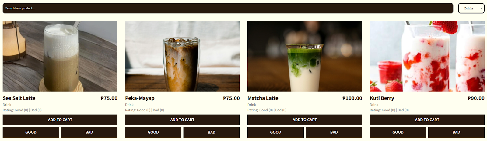
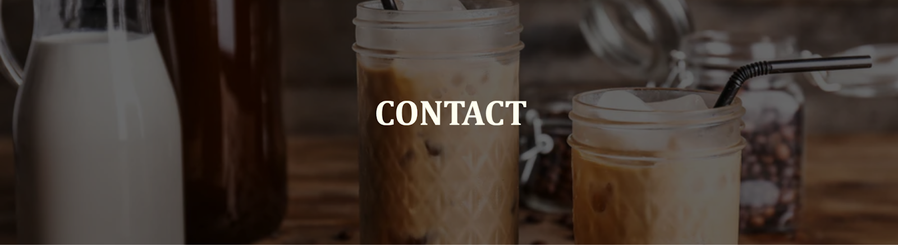
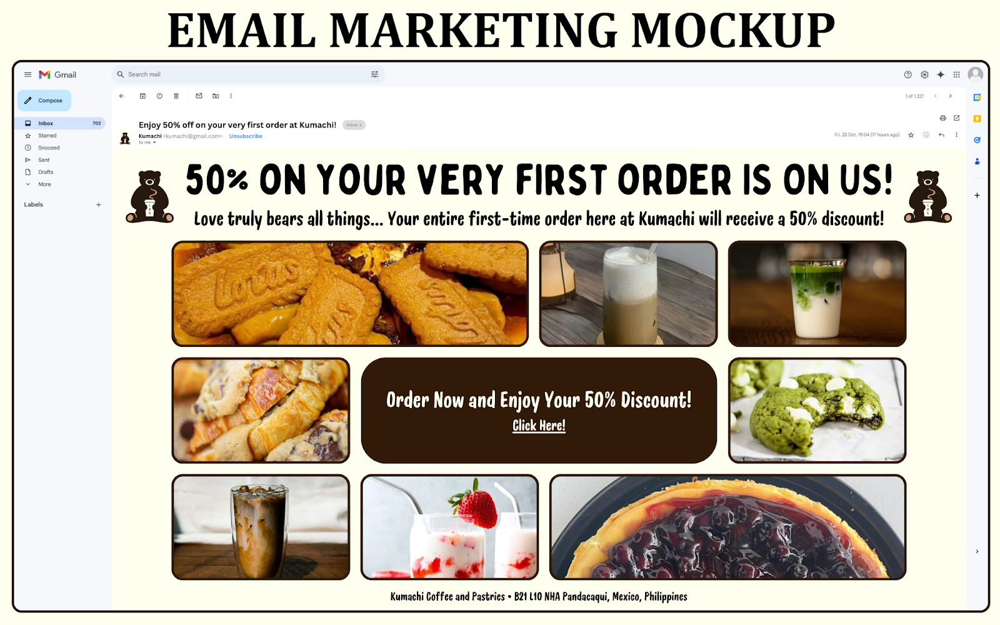
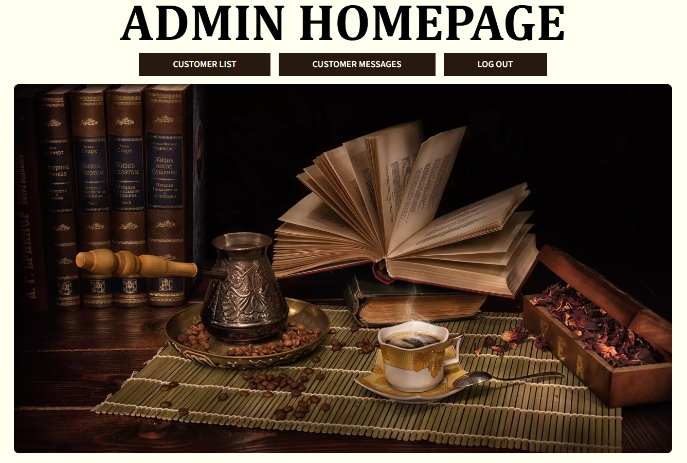
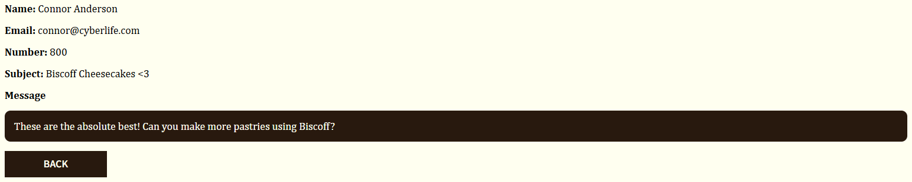

# Kumachi Coffee and Pastries Website
This is a dynamic website we created for a selected local business using HTML, CSS, and JavaScript as a group final project requirement for the WEBPUB course. Its main goal is to enhance the company's marketing strategy by providing a platform for visitors to be informed and have interaction with what the business offers. The website consists of five (5) pages, namely the Landing page, Products page, Feature page, Contact page, and Admin page. Key features include responsive web design, an add-to-cart system, gallery view, rating system, search feature, filtering options, form submission, email/social media marketing mockups, and admin-exclusive pages via login.

## Starting the Web Application
1. After downloading the files, go to the folder where those files are stored and open VSCode.

   
   
2. Initially, the node_modules folder is not included. Ensure that all dependencies are installed by opening the terminal in VSCode and run the following command:
   ```
   npm install
   ```
3. To run the website, type this command in the same terminal: Run the website by typing node index.js in the terminal. 
   ```
   node index.js
   ```
   The server would be listening on port 3000.
4. Visit the website by typing the following on the search bar of your preferred browser:
   ```
   localhost:3000
   ```
5. You are all set! Enjoy everything that Kumachi has to offer.

## Navigating Kumachi
### A. Sitewide Features
On every page of Kumachi’s website, except for the Admin page, the following features are present:

1. The Nav Bar


Users have the ability to move from one page to another with ease by using this nav bar which is present at the top of the screen. The five (5) pages users can go to are: The Homepage, The Products Page, The Featured Page, The Contact Page, and The Admin Page. Additionally, users can also click on Kumachi’s logo on the left side of the nav bar if they want an alternative mode of going back to the homepage. On the right side of the nav bar, there is a “GET A COFFEE” button, which transports users to the Products page, immediately starting the webpage where the products are located. Next to that button is the user’s cart, which can be used to check, edit, delete, and finalize everything the user has selected and wants to buy from the Products page (learn more about this feature in the Products Page segment of this README).

2. The Call to Action Button


This call to action button prompts users to order from Kumachi’s fine selection of drinks and pastries by redirecting them to the Products page, where all of the products are located. Of course, the goal of the business is to increase customer orders, which is why this button is prevalent in every webpage.

3. The Footer


At the end of each webpage, after the call to action button is the website’s footer. Important details about the business, such as its location, opening hours, and social media handles are found here. Additionally, players can also use this footer as a means to navigate to other pages, without needing the nav bar. In the “Coffee” column are the pages available, and the “Shop” column allows users to once again go to the Products page when they are now in the mood to place an order.

### B. Homepage
The homepage, otherwise known as the landing page greets users whenever they visit the website. The website starts with a hero image, containing text and a call to action button that works the same as the nav bar’s “GET A COFFEE” button, and the “GRAB A COFFEE” button before the footer.


After the hero image, users can learn more about Kumachi in the “WHO WE ARE” section of the page. Clicking the “LEARN MORE” button here will redirect users to the Featured page.


Still not convinced on trying out Kumachi? Below the “WHO WE ARE” section, there are three (3) things that highlights Kumachi: Ambiance, Quality, and Affordability.


Finally, users are greeted with a carousel gallery that automatically slides to the left to feature a new image after every few seconds. Additionally, users have the option to press the left or right buttons, if they want to manually control the gallery.


### C. Products Page


The products page allows users to browse Kumachi’s fine selection of drinks and pastries.


On the uppermost part of the screenshot above are the search and filtering options. Users can look for a specific product in mind using Kumachi’s built-in search bar. Additionally, users can also filter which type of product they would like to see. By default all products are shown, but users can opt to just check out only Kumachi’s drinks, or only their pastries.





For each product shown, users can click on a product’s image to show the product’s modal, which displays additional information about the selected product.


Once you find something that you want to try out, add the product(s) to your cart by clicking on the “ADD TO CART” button. This will update the cart icon on the right side of the nav bar. A number on the upper-right corner of the cart icon will display the total number of items you have on your cart.


Clicking on the cart icon will display every product you have added to your cart so far, including each product’s subtotal price and the overall total of your entire cart.


Users can add or subtract each item’s quantity in their cart with the plus (+) and minus (-) buttons under each product’s name. If you click on the minus (-) button and the item quantity reaches zero (0), the product will be removed from the cart. Clicking on the “CLEAR CART” button will show a confirmation message, which requires users to confirm if they truly want to clear everything in their cart or not. The “CHECKOUT” button finalizes the user’s order. However, this feature is not yet implemented and clicking on this button would not redirect you to an order confirmation page.


Lastly, once users have tried out a certain product, they have the ability to rate it using the “GOOD” or “BAD” buttons at the very bottom of the selected product. This will update the product’s rating on top of the “ADD TO CART” button and inside the product’s modal.


### D. Featured Page


The featured page showcases various videos, images, and additional information regarding Kumachi. This page is a great way for users to familiarize themselves about the business’s overall theme and purpose.

The videos in this webpage automatically play and loop. Users can pause, mute/unmute, and watch the video in fullscreen with the controls at the bottom part of each video. Additionally, the three (3) dots at the rightmost part of the controls allows users to: download the video, change playback speed, and enter picture-in-picture mode.


Kumachi’s matcha drink video:


Kumachi’s “WHO WE ARE” section with a gallery of its products:


Kumachi’s “Did you know?” section (facts and trivia):


Kumachi’s “Cold and Hot Brew” and “Cakes and Pastries” sections (about their drinks and pastries):


Created infographic for the featured page:


Kumachi’s matcha cookies video:


Kumachi’s “WHAT SETS US DIFFERENT?” section (what makes the business unique from its competition):


### E. Contact Page



In the contact page, users can get in touch with the people working on Kumachi by checking out their location with the map provided, reaching out through phone or social media, and by filling out the “Send a Message” form.


If users opt to fill out the form, they are required to answer every field. Failing to do so will not submit the form. After submitting the form, users are redirected to a page depending on their preferred promotional marketing method. If the user chooses email, he/she will see a mockup of promotional email marketing if Kumachi actually starts sending emails to users who are subscribed to their newsletter. On the other hand, if the user chooses social media, he/she will see three (3) mockups of promotional social media marketing if Kumachi decides to promote their brand using Facebook, Instagram, and YouTube as their social media platforms.

Example submitted forms:


Social media marketing mockups:


Email marketing mockup:



### F. Admin Page
Once a user has filled out and submitted the form in the contact page, his/her message and user information will be accessible via the admin page. However, you will first be greeted with a login screen, which would require a username and password before you can proceed.

Username: **hanni**
Password: **abc123**

The login screen:


The admin homepage:



Clicking on the “CUSTOMER LIST” button will display all user information of the customers who have submitted the form in the contact page.

Example customer list:


Additionally, the admin can search for a specific customer using an ID number or the customer’s name.

Searching for a customer using an ID number:


Searching for a customer using the customer’s name:


On the rightmost side of the customer’s information, the admin can click on the “VIEW MESSAGE” button to see the customer’s message that he/she submitted through the form. Alternatively, back at the admin homepage, the admin may also choose to click on the “CUSTOMER MESSAGES” button, to also display a customer’s message.

Example of a customer's message:



## Key Features
- **Responsive web design** for a seamless experience across all devices, whether mobile, tablet, or desktop.
- **Add-to-cart system** that allows users to easily select, review, and manage their chosen items before checkout.
- **Gallery view** for a visual showcase of products.
- **Rating system** to enable customers to provide feedback on products, helping improve offerings through user insights.
- **Search** and **filtering options** to help users find specific items quickly.
- **Form submission** which allows users to send meaningful messages and feedback.
- **Email/social media marketing mockups** for possible promotions and brand development.
- **Admin-exclusive pages** to allow admins to learn more about their customers and strategize the business’s growth.


## About the Business
The website is designed for **Kumachi**, a coffee and pastry shop located in Pandacaqui, Mexico, Pampanga. The shop offers a cozy, inviting, and comfortable atmosphere inspired by Japanese culture. It operates from 12 nn to 12 am every day except Wednesday. Kumachi initially ran online for 6 months and has now transitioned to a physical store, which has been open for the past two months.

## Team
- [Cayanan](https://github.com/lmcay)
- [David](https://github.com/K8Dvd)
- [Natividad](https://github.com/itsjayceee)
- [Tayag](https://github.com/CJT22)
- [Valdez](https://github.com/jimvdz)

Copyright &copy; 2024 by Kumachi Coffee and Pastries, Cayanan, David, Natividad, Tayag, and Valdez. All rights reserved.
